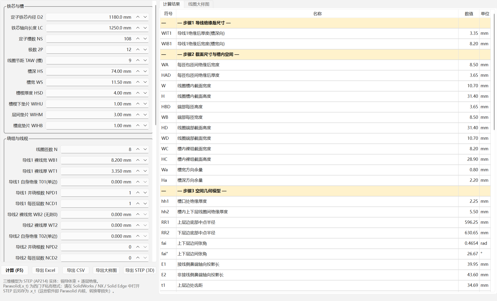
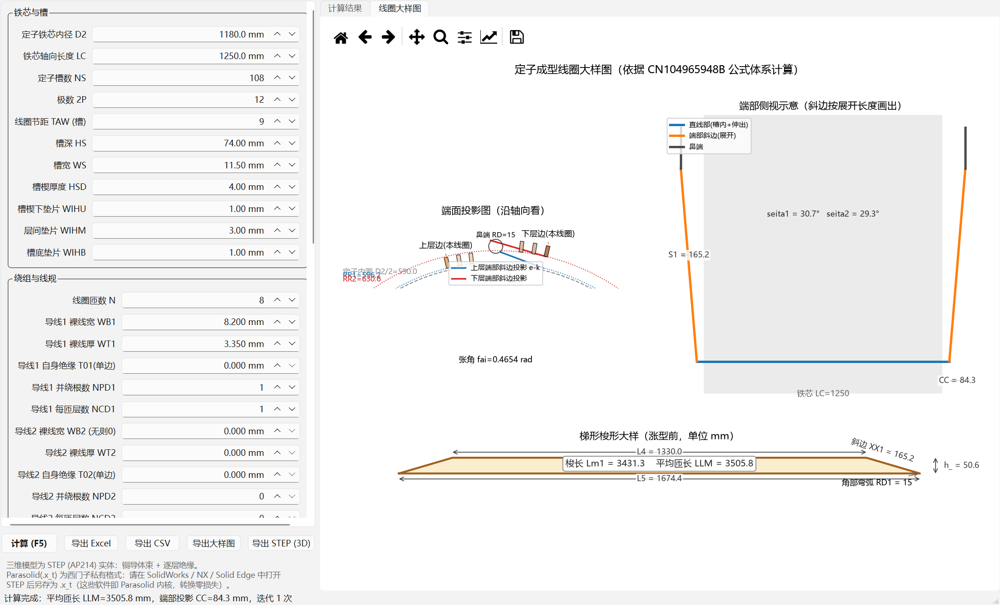
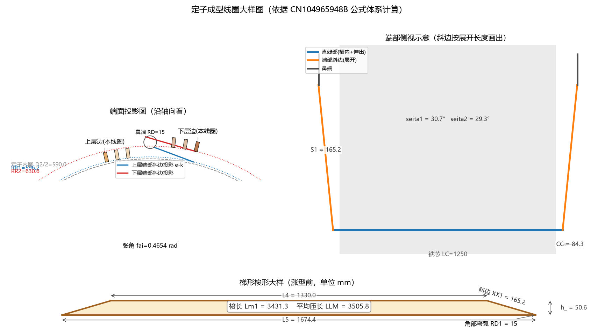
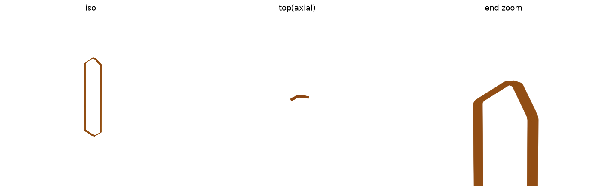

# CoilDrawing 使用教程

本软件用于**交流电机定子成型线圈（梭形/菱形硬绕组线圈）**的参数计算、大样图绘制与三维建模。
公式体系来自专利 **CN104965948B《一种交流电机定子绕组线圈参数的计算方法》**（湘潭电机，2015）。

输入铁芯、槽形、线规、绝缘和端部结构参数，软件即可算出：

- 线圈槽内/端部截面尺寸，并校验线圈能否放进槽；
- 端部空间几何（轴向投影长 CC、斜边弧长 S1/S2、上下层边夹角等）；
- **平均匝长 LLM 与单线圈用线长**（下料依据）；
- **梯形梭形参数**（绕线模 / 涨型前大样）；
- 线圈大样图（工程制图风格，PNG/PDF/SVG）与**三维实体模型**（STEP 格式）：
  可选**逐匝精细模型**（铜线逐匝、匝绝缘/对地绝缘分层、轴向引线、防晕层、
  槽内垫片/槽楔）或**简化束模型**（等效整束）。

每次任务对应一个**工作空间目录**：参数保存在其中的 `config.txt`
（纯文本、可手工编辑），各类导出默认放入其中的 `output` 子目录（见[第 9 节](#9-工作空间与配置文件-configtxt)）。

---

## 目录

1. [安装与启动](#1-安装与启动)
2. [界面总览](#2-界面总览)
3. [快速上手：三分钟算一个线圈](#3-快速上手三分钟算一个线圈)
4. [输入参数详解](#4-输入参数详解)
5. [计算与结果解读](#5-计算与结果解读)
6. [线圈大样图](#6-线圈大样图)
7. [导出功能](#7-导出功能)
8. [STEP 转 Parasolid (.x_t)](#8-step-转-parasolid-x_t)
9. [工作空间与配置文件 config.txt](#9-工作空间与配置文件-configtxt)
10. [进阶：脚本方式调用](#10-进阶脚本方式调用)
11. [计算原理与验证](#11-计算原理与验证)
12. [打包成免安装 exe 与分发](#12-打包成免安装-exe-与分发)
13. [常见问题 FAQ](#13-常见问题-faq)

---

## 1. 安装与启动

> **拿到的是打包版（文件夹里有 CoilDrawing.exe）？** 不需要装任何东西，
> 直接双击 `CoilDrawing.exe` 即可使用，本节可跳过。打包与分发见[第 12 节](#12-打包成免安装-exe-与分发)。

从源码运行时，本项目用 [uv](https://docs.astral.sh/uv/) 管理 Python 环境与依赖，**无需自己安装 Python**（uv 会自动准备 Python 3.12）。

### 1.1 安装 uv（只需一次）

Windows PowerShell 中执行：

```powershell
powershell -ExecutionPolicy ByPass -c "irm https://astral.sh/uv/install.ps1 | iex"
```

安装后重开一个终端，输入 `uv --version` 能看到版本号即成功。

### 1.2 安装依赖并启动（首次）

```powershell
cd C:\Users\19144\Desktop\CoilDrawing
uv sync          # 首次安装依赖（PySide6、build123d、matplotlib、openpyxl 等），需几分钟
uv run main.py   # 启动软件
```

之后每次使用只需要：

```powershell
cd C:\Users\19144\Desktop\CoilDrawing
uv run main.py          # 或等价命令：uv run coildrawing
```

> 首次启动会弹出主窗口并自动用**专利算例参数**完成一次计算，右侧立即能看到结果。

---

## 2. 界面总览

窗口分为四个区域（标题栏同时显示当前**工作空间**路径）：

| 区域 | 内容 |
| --- | --- |
| **菜单栏 文件(F)** | 选择/新建工作空间、导入配置文件、保存配置 (Ctrl+S)、重新载入配置 (F6)、打开工作空间文件夹 |
| **左侧（可滚动）** | 参数输入表单，按"铁芯与槽 / 绕组与线规 / 绝缘 / 三维对地·匝绝缘分层 / 三维模型选项 / 端部结构"分组 |
| **右侧标签页** | **计算结果**（参数表）和**线圈大样图**（图形预览）两页 |
| **左下按钮栏** | `计算 (F5)`、`导出 Excel`、`导出 CSV`、`导出大样图`、`导出 STEP (3D)` |
| **底部状态栏** | 显示计算摘要（平均匝长、端部投影、迭代次数）和警告条数 |

数值输入框为**自由文本输入**：支持最多 8 位小数（也可用科学计数法如
`1e-9`），**鼠标滚轮不会改变数值**（避免误触）；整数参数（槽数、匝数等）
仍带上下箭头微调按钮，但同样不响应滚轮。

计算结果页（结果按专利步骤 1–6 分节，黄色行为分节标题）：



线圈大样图页（端面投影 + 端部侧视 + 梯形梭形大样）：



---

## 3. 快速上手：三分钟算一个线圈

1. **启动软件**：`uv run main.py`。首次启动会请你**选择（或新建）一个工作空间目录**——参数配置 `config.txt` 与导出目录 `output` 都放在里面；以后启动自动打开上次的工作空间。界面默认填好了专利 CN104965948B 的算例参数（1180 内径、108 槽、节距 9、8 匝扁铜线），可以直接当模板改。
2. **改参数**：在左侧表单中把 D2、LC、槽数、节距、槽形尺寸、线规、绝缘厚度改成你的电机数据（各参数含义见[第 4 节](#4-输入参数详解)）。
3. **按 F5 计算**（或点左下角"计算"按钮）。状态栏会显示：

   > 计算完成：平均匝长 LLM=xxxx.x mm，端部投影 CC=xx.x mm，迭代 n 次

4. **看结果**：右侧"计算结果"页从上到下按步骤列出全部中间量和最终结果；如有红色 ⚠ 行，务必阅读（见 [5.3 警告](#53-警告信息一览)）。
5. **看图**：切到"线圈大样图"页检查线圈形态是否合理。
6. **导出**：需要报表点`导出 Excel`；需要图纸点`导出大样图`；需要三维模型点`导出 STEP (3D)`，再按[第 8 节](#8-step-转-parasolid-x_t)转成 Parasolid。

---

## 4. 输入参数详解

所有长度单位为 **mm**，角度单位为 **rad**（弧度）。括号内是专利中的符号。
**所有绝缘厚度均按"单边厚度"填写**，公式内部会自动按两侧（×2）计入。

数值输入支持最多 **8 位小数**（10⁻⁸ mm）；计算内部为全精度双精度浮点，
结果表同样显示到 8 位小数（自动去掉无意义的尾零）。

### 4.1 铁芯与槽

| 参数 | 说明 |
| --- | --- |
| 定子铁芯内径 D2 | 定子冲片内圆直径 |
| 铁芯轴向长度 LC | 铁芯叠压长度 |
| 定子槽数 NS | 定子槽数 |
| 极数 2P | 仅作记录，**不参与专利公式**（公式用节距 TAW 描述跨距） |
| 线圈节距 TAW（槽） | 线圈两直线边跨过的槽数；全距绕组时等于极距 NS/2P（算例：108 槽 12 极，TAW=9） |
| 槽深 HS / 槽宽 WS | 定子槽尺寸 |
| 槽楔厚度 HSD | 槽楔（含楔下垫条时另算 WIHU） |
| 槽楔下垫片 WIHU | 槽楔下绝缘垫片厚度 |
| 层间垫片 WIHM | 同槽上、下层线圈之间的垫片厚度 |
| 槽底垫片 WIHB | 槽底绝缘垫片厚度 |

### 4.2 绕组与线规

| 参数 | 说明 |
| --- | --- |
| 线圈匝数 N | 单个线圈的匝数 |
| 导线1 裸线宽 WB1 | 扁铜线裸线**沿槽宽方向**的尺寸 |
| 导线1 裸线厚 WT1 | 扁铜线裸线**沿槽深方向**的尺寸 |
| 导线1 自身绝缘 T01（单边） | 漆膜/薄膜绕包等导线自身绝缘 |
| 导线1 并绕根数 NPD1 | 沿**槽宽方向**并列的根数 |
| 导线1 每匝层数 NCD1 | 每匝内沿**槽深方向**叠放的层数 |
| 导线2 …… | 第二种线规（**两种线规并绕**时填写；只用一种线规时全部填 0） |

> 每匝宽度取 `max(WIB1×NPD1, WIB2×NPD2)`，每匝厚度取 `WIT1×NCD1 + WIT2×NCD2`（专利步骤 2）。

### 4.3 绝缘（单边厚度）

| 参数 | 说明 |
| --- | --- |
| 槽内匝间绝缘 T1 | 槽内直线段的匝间绝缘 |
| 端部匝间绝缘 T3 | 端部的匝间绝缘 |
| 槽内对地绝缘 T2 | 槽内主绝缘（云母带包扎总厚，单边） |
| 端部对地绝缘 T4 | 端部主绝缘（单边） |
| 槽内防晕层 CS | 高压电机防晕带/防晕漆（无则 0）。**三维模型防晕层的厚度直接取此值**，计算与模型天然一致 |

### 4.4 三维模型绝缘分层（两张表）

这两张表**只影响三维 STEP 模型与槽内截面图**的分层显示，不影响数值计算
（数值计算用 T1/T2/T3/T4）。操作方式相同：每行一层、从内到外排列，
`＋ 添加层` / `－ 删除选中层` 增删行，双击单元格改名称和厚度。

| 表 | 包什么 | 总厚要求 |
| --- | --- | --- |
| **对地绝缘分层** | 包住整个线圈束的"方壳"主绝缘（云母带等） | ≈ 槽内对地绝缘 T2 |
| **匝绝缘分层** | 包在**每一匝导线束**外的云母带（截面上每匝可见） | ≈ 槽内匝间绝缘 T1 |

总厚不一致时计算会给出警告（刻意为之可忽略）。
例如 T2=1.1 mm 分两层各 0.55；T1=0.15 mm 一层"匝间云母带" 0.15。

### 4.5 三维模型选项（逐匝精细建模）

| 参数 | 说明 |
| --- | --- |
| 导出 STEP 模型 | **逐匝精细模型**（铜线逐匝+分层绝缘+引线，真实结构）或**简化束模型**（等效整束，生成快、文件小） |
| 引线折弯半径 | 引线从端臂（斜边端点）转向轴向伸出处的折弯半径 |
| 引线端头裸铜长 | 引线末端剥去绝缘的裸铜长度（焊接位），填 0 则不留；引线伸出长度用"引线长 ysc" |
| 绘制槽部防晕层 | 勾选后在两条直线边槽部包一层黑色半导电防晕层（高压电机用，即实物照片中槽部黑色的部分）。**厚度取"槽内防晕层 CS"**；勾选时若 CS=0 会自动填入 0.30 |
| 防晕层每端伸出铁芯 | 每端伸出量，**沿导线路径计量**：超过直线段的部分自动越过槽口弯角、沿端臂向鼻端弯曲延伸（与实物一致），最多至斜边长度的 85%，超出会给警告并截短 |
| 槽内固定件加入模型 | 四个复选框自由勾选：**槽楔 HSD**、**槽楔下垫片 WIHU**、**层间垫片 WIHM**、**槽底垫片 WIHB**。按截面堆叠位置生成在上、下层边所在的两个槽内（厚度取"铁芯与槽"组对应参数，长度=LC、宽度=WS） |

### 4.6 端部结构

| 参数 | 说明 |
| --- | --- |
| 齿压板轴向长度 LD | 铁芯端部齿压板（无则 0） |
| 直线部伸出铁芯 LE | 线圈直线段伸出铁芯（含齿压板外）的长度 |
| 鼻端抬高 F | 端部鼻端相对线圈边的径向抬高量 |
| 鼻端中心线夹角 seita3 | 鼻端中心线与过鼻端弯弧中心点直径的夹角（rad，算例 0.349≈20°） |
| 鼻端半径 RD | 线圈端部鼻端（拐弯处）半径 |
| 接线侧弯弧半径 RD1 | 用于计算接线侧鼻端轴向投影长 E1 |
| 非接线侧弯弧半径 RD2 | 用于计算非接线侧鼻端轴向投影长 E2 |
| 直线部-斜边弯曲半径 rd1 | 直线段与端部斜边连接处的弯曲半径 |
| 斜边-鼻端弯曲半径 rd2 | 端部斜边与鼻端连接处的弯曲半径 |
| 端部间隙给定值 Ba | 相邻线圈端部之间要求保证的间隙（迭代收敛目标） |
| 引线长 ysc | 每根引线长度，计入单线圈用线长 |
| 迭代误差 ξ | 端部迭代收敛判据（10⁻¹²~0.02，默认 1e-9，保证结果的 8 位小数收敛可信） |

---

## 5. 计算与结果解读

### 5.1 计算

修改任何参数后**必须点"计算"按钮或按 F5** 重新计算（软件不会自动重算）。
计算瞬间完成；每次成功计算后当前输入会自动写入工作空间的
`config.txt`（见[第 9 节](#9-工作空间与配置文件-configtxt)）。

### 5.2 结果表各节含义

结果表按专利步骤分为 6 节（黄色行为分节标题），工程上最常用的量加粗标出：

| 节 | 主要结果 | 工程用途 |
| --- | --- | --- |
| 步骤1 导线绝缘后尺寸 | WIT/WIB | 校对线规 |
| 步骤2 截面尺寸与槽内空间 | W×H 槽内截面、WD×HD 端部截面、WC×HC 裸组截面、**Wa/Ha 槽内余量** | 嵌线可行性：Wa、Ha 必须 ≥ 0 |
| 步骤3 空间几何模型 | RR1/RR2 上下层边半径、fai 张角（同时给 rad 和 °）、E1/E2 鼻端投影、t1/t2 齿距 | 端部空间校核 |
| 步骤4 弯弧判定 | 是否需要弯弧、弯弧半径 rr1/rr2、AA1/AA2 | 判断上层边端部是否会低于定子内圆，需要时按弧成型 |
| 步骤5 端部与匝长 | **CC 端部轴向投影长**、seita1/seita2 斜边与端面夹角、Ba1/Ba2 实际间隙、S1/S2 斜边弧长、X1/X2、K1/K2、**LLM 平均匝长**、**L总 单线圈用线长（含引线）** | 端部成型参数与**铜线下料** |
| 步骤6 梯形梭形（绕线模） | **XX1 斜边长、L4 上底、L5 下底、h_ 高、Lm1 梭长** | **绕线模尺寸 / 涨型机设定** |

状态栏摘要中的"迭代 n 次"指端部间隙迭代的次数（通常 1~3 次即收敛）。

### 5.3 警告信息一览

警告显示在结果表**底部的红色 ⚠ 行**，并计入状态栏。含义与处理：

| 警告 | 含义与处理 |
| --- | --- |
| 槽宽方向余量 Wa < 0 | 线圈横向放不进槽。减小线宽/并绕根数/绝缘厚度，或加大槽宽 |
| 槽深方向余量 Ha < 0 | 上下两层线圈叠起来超过槽深。减少匝数/线厚，或加大槽深 |
| 下层边端部实际间隙 Ba2 小于给定值 Ba | 专利算法只按**上层边**间隙收敛（原文设计如此），下层边间隙偏小是常见现象；请人工确认工艺可接受 |
| 三维绝缘分层总厚与 T2 不一致 | 三维模型外形将与计算截面不符；调整分层表使总厚 ≈ T2，或刻意为之则忽略 |
| 匝绝缘分层总厚与 T1 不一致 | 同上，调整匝绝缘分层表使总厚 ≈ T1 |
| 已勾选绘制防晕层但 CS=0 | 防晕层厚度取 CS，CS=0 时模型中不会生成防晕层；请在"绝缘"组填入 CS（典型 0.2~0.5 mm） |
| 防晕层每端伸出超过沿导线可延伸长度 | 伸出量超过"直线段+槽口弯角+斜边 85%"的总长，三维模型中将截短；减小伸出量即可消除 |
| 梯形梭形高度 h_ 出现负平方 | 端部参数组合不合理（S2²+RD1²<XX1²），核对鼻端半径、节距、端部间隙 |

另有一种**计算直接失败**的情况会弹红色对话框：

> 端部中心距 BD ≥ 上层齿距 t1，端部间隙无法满足

说明线圈端部宽度 WD 加间隙 Ba 已超过一个齿距，物理上排不下——需减小线圈宽度、绝缘厚度或端部间隙 Ba。

---

## 6. 线圈大样图

"线圈大样图"页为工程制图风格组合图（带图框与标题栏，导出文件相同），由四个视图组成：



| 视图 | 内容 |
| --- | --- |
| **端面投影图**（左上，沿轴向看） | 定子内圆与 RR1/RR2 基准圆（点划线）、本线圈上下层边截面与相邻线圈（淡色）、上下层端部斜边投影 e-k、鼻端圆、张角 fai |
| **端部侧视图**（右上） | 直线部、端部斜边（按展开长度）、鼻端、**轴向引线示意**；剖面线区域为铁芯；标注 L2、CC、S1、seita1/seita2 |
| **槽内截面图**（右侧，真实比例） | 定子槽剖面：槽楔/垫片/**逐匝铜线**/匝绝缘/对地绝缘分层/防晕层，配色与三维模型一致，标注 HS/WS/H 及各层引出说明 |
| **梯形梭形大样**（下方，涨型前） | 绕线模平面形状（含角部弯弧 RD1 的真实圆角轮廓）：上底 L4、下底 L5、高 h_、斜边 XX1，并标注梭长 Lm1 与平均匝长 LLM |

图上方是 matplotlib 工具栏：🏠 复位视图、🔍 框选放大、十字箭头平移、💾 把当前视图另存为图片。

---

## 7. 导出功能

所有导出按钮都会先确保有最新计算结果（没有则自动计算一次），然后弹出保存对话框。
保存对话框**默认定位到工作空间的 `output` 目录**（自动创建），也可以自由选择任意其他位置。

### 7.1 导出 Excel

生成 `.xlsx`，含 2~3 个工作表：

- **输入参数**：本次计算的全部输入（含绝缘分层表），可作为设计记录归档；
- **计算结果**：与界面结果表一致（分节、右对齐数值）；
- **警告**：仅当存在警告时生成。

### 7.2 导出 CSV

单文件纯文本表格，首列为"类别"（输入/结果/警告）。采用 `UTF-8 with BOM` 编码，**Excel 双击打开中文不乱码**，也方便其他程序读取。

### 7.3 导出大样图

把第 6 节的组合图保存为 **PNG（150 dpi）**、**PDF** 或 **SVG**
（后两种为矢量格式，打印/放大不失真，在保存对话框中切换文件类型即可）。

### 7.4 导出 STEP (3D)

生成三维实体装配（STEP AP214），模型类型在"三维模型"组中选择：

**逐匝精细模型**（默认）——真实线圈结构：

- **铜导线**：一根（并绕时多股，每股独立部件）连续扁铜线绕 N 匝的螺旋实体，
  匝间换位爬升位于接线侧鼻端平直段（N-1 条坡道彼此错开整一个匝距，
  与引线完全分离，出线端头无导线重叠）；支持并绕 NPD、每匝多层 NCD、双线规混绕；
- **导线自身绝缘**：T0>0 时每股外的漆膜壳；
- **匝绝缘 1..n**：按匝绝缘分层表包在每匝导线束外（截面上每匝可见几层云母带）；
- **对地绝缘 1..n**：按对地分层表包住整个线圈束的"方壳"，引线穿出处开孔；
- **引线**：引入线在第 1 匝（最内层）斜边退让后折弯；引出线在第 N 匝
  （最外层）斜边**末端**折弯（不退让，避免穿进内层匝）；一内一外沿轴向竖直伸出——
  长度=引线长 ysc、折弯半径可调，端头留可调长度**裸铜**（绝缘让开）；
  对地绝缘在引线穿出处按铜∪匝绝缘包络贴身开孔；
- **防晕层**（可选）：两条直线边槽部的黑色半导电套管，厚度=CS；
  每端伸出量沿导线计量，可越过槽口弯角沿端臂向鼻端弯曲延伸；
- **槽内固定件**（可选）：槽楔 / 槽楔下垫片 / 层间垫片 / 槽底垫片，
  在两个槽内按真实径向位置生成。

**简化束模型**——铜导体等效整束（WC×HC）+ 对地绝缘分层壳（+防晕层/固定件），
生成只需数秒、文件小，适合快速查看外形。

**所有部件均为有效封闭实体**（导出前逐件校验），在 SolidWorks 等软件中
以"实体"而非"曲面实体"导入，可直接剖切、测量、做布尔运算。

**部件中文名**按 ISO 10303-21 标准 `\X2\` Unicode 转义写入 STEP，
SolidWorks 等软件打开可正确显示中文、可在特征树中改名、可进 BOM。
**每个部件都带颜色**：铜导线=铜色、导线自身绝缘=深红棕、匝间云母带=金黄、
对地云母带=黄褐分层、防晕层=黑色、垫片=灰白、槽楔=棕黄
（STEP 只携带颜色，不携带材质，导入后"材质<未指定>"属正常，需要时在 CAD 中赋材质）。

**SolidWorks 导入建议**（设置 → 系统选项 → 导入，文件格式“普通”）：

| 选项 | 中文名 / 装配层级 | 颜色 | 说明 |
| --- | --- | --- | --- |
| **启用 3D Interconnect** | 中文名与二级零件层级通常正确 | 本软件已按零件原型写入颜色；若仍全白，可在特征树中手动上色 | 推荐用于核对树结构与中文名 |
| **不启用 3D Interconnect** | 中文名可能显示为 `\X2\...` 或乱码 | 颜色通常正确 | 经典翻译器对 Unicode 转义支持较差；个别复杂零件可能出现“重建模型”警告（导出前已做面合并与 ShapeFix） |

两种模式可按需要切换：要中文树用 Interconnect，要快速看颜色可用经典模式。



注意事项：

- 点击按钮后在**后台线程**建模，界面不卡死；按钮会变成"正在生成 3D…"；
- 首次导出需加载 OCCT 几何内核（约 10~30 秒）；**逐匝精细模型建模约
  15~60 秒**（匝数/股数越多越慢），简化束模型数秒；
- 逐匝模型 STEP 文件约几 MB 到几十 MB，SolidWorks 打开较慢属正常；
- 完成后弹窗列出全部部件名，状态栏显示保存路径。

---

## 8. STEP 转 Parasolid (.x_t)

Parasolid 是西门子的**私有**几何内核格式，开源工具链无法直接生成 `.x_t` 文件。
本软件导出的 STEP 为无损 B-Rep 实体，用任一 Parasolid 内核的 CAD 打开后**零损失**转换：

| 软件 | 操作 |
| --- | --- |
| **SolidWorks** | 文件 → 打开（选 `.step`）→ 文件 → 另存为 → 保存类型选 `Parasolid (*.x_t)` |
| **NX (UG)** | 文件 → 打开（类型选 STEP）→ 文件 → 导出 → Parasolid，选择版本后导出 |
| **Solid Edge** | 打开 `.step` → 另存为 → `Parasolid 文档 (*.x_t)` |

> 这三款软件本身就构建在 Parasolid 内核上，STEP→x_t 只是内核数据的重新序列化，不产生几何误差。
> 如需程序直接输出 .x_t，需接入商业 SDK（如 CAD Exchanger Python API），`src/coildrawing/model3d.py` 的导出层已按可替换设计预留。

---

## 9. 工作空间与配置文件 config.txt

### 9.1 工作空间

每次任务对应一个**工作空间目录**：

- 首次启动时软件请你选择（或在对话框里新建）一个目录；以后启动**自动打开上次的工作空间**；
- 菜单 `文件 → 选择/新建工作空间…` 可随时切换/新建；
- 目录内容：`config.txt`（全部参数）+ `output\`（各类导出的默认位置）；
- 换电脑/给同事：把整个工作空间目录拷走即可，参数随目录走。

### 9.2 config.txt

`config.txt` 是 **INI 风格的纯文本**（UTF-8，带中文注释），按
"铁芯与槽 / 绕组与线规 / 绝缘 / 端部结构 / 三维模型 / 对地绝缘分层 / 匝绝缘分层"分节：

```ini
[铁芯与槽]
D2              = 1180              ; 定子铁芯内径 mm
LC              = 1250              ; 铁芯轴向长度 mm
...
[对地绝缘分层]
层1 = 对地云母带 1 | 0.55
层2 = 对地云母带 2 | 0.55
```

双向同步规则：

- **软件 → 文件**：每次成功计算（F5）或 `Ctrl+S` 都会把当前界面参数写回 `config.txt`；
- **文件 → 软件**：用任意文本编辑器修改保存后，软件立即检测到并弹窗询问"是否载入新参数并重新计算"；也可用菜单 `文件 → 重新载入配置 (F6)` 手动载入；
- 开关量填 `是/否`（也接受 true/false、1/0、开/关）；分号 `;` 后是注释；
- 注意两对大小写不同的参数：`RD1/RD2`（接线/非接线侧弯弧半径）与 `rd1/rd2`（直线部-斜边、斜边-鼻端弯曲半径）。

### 9.3 导入已有配置 / 模板

- `文件 → 导入配置文件…`：选择任意名字的 `.txt`（如 `ABC.txt`），软件先验证内容，
  然后**复制进当前工作空间并改名为 `config.txt`**（原文件不动）；
- 软件自带默认模板 `config_template.txt`（打包版在 exe 同目录；源码版在 `docs\` 下），
  内容即专利算例参数，可拷贝改名后作为新任务的起点；
- **恢复出厂默认**（专利算例参数）：新建一个空工作空间即可（config.txt 会按默认参数生成）。

---

## 10. 进阶：脚本方式调用

计算引擎与导出函数都可脱离界面直接调用，适合批量计算或接入其他流程：

```python
# 保存为 batch_demo.py，运行：uv run batch_demo.py
from coildrawing.engine import CoilInput, WireSpec, InsulationLayer, compute
from coildrawing.export import export_xlsx
from coildrawing.drawing2d import save_png
from coildrawing.model3d import export_step

inp = CoilInput(
    d2=850.0, lc=980.0, ns=90, taw=8,
    hs=68.0, ws=10.5,
    n_turns=6,
    wire1=WireSpec(b=7.1, h=3.0, t0=0.15, npd=1, ncd=1),
    t2=1.2, t4=1.2,
    cs=0.3, corona_on=True,        # 防晕层（厚度=CS），伸出量用 corona_overhang
    draw_wihm=True,                # 把层间垫片加入三维模型
    layers=[InsulationLayer("云母带 1", 0.6), InsulationLayer("云母带 2", 0.6)],
)
res = compute(inp)
print(f"平均匝长 LLM = {res.llm:.1f} mm，用线长 = {res.wire_total:.0f} mm")
for w in res.warnings:
    print("警告:", w)

export_xlsx(res, "out.xlsx")   # 报表
save_png(res, "out.png")       # 大样图
export_step(res, "out.step")   # 三维模型（首次调用较慢）
```

`CoilInput` 的全部字段及默认值见 `src/coildrawing/engine.py`，字段名与本教程第 4 节的符号一一对应。
也可以直接读写工作空间配置：`from coildrawing.config_io import load_config, save_config`。

---

## 11. 计算原理与验证

计算流程严格按专利 CN104965948B 的六个步骤实现（`src/coildrawing/engine.py`）：

1. 导线绝缘后尺寸（支持两种线规并绕）；
2. 槽内/端部截面尺寸，槽内剩余空间验证；
3. 线圈空间几何模型（RR1/RR2/张角 fai/鼻端投影 E1、E2/齿距 t1、t2）；
4. 上下层边弯弧判定（电机中心至端部斜边投影线的距离 D 与 RR1 比较）；
5. 端部迭代：以"上层边端部实际间隙 Ba1 = 给定值 Ba"为收敛目标，迭代求端部轴向投影长 CC，进而得 S1/S2、X1/X2、K1/K2 与平均匝长 LLM；
6. 梯形梭形参数（绕线模大样）。

**验证方式**：`tests/test_engine.py` 用专利"具体实施方式"的完整算例做回归测试——截面链路与几何链路按算例值精确断言，端部链路（CC=92、seita1=0.7112 rad、S1=141 等）按 ±1% 断言。运行：

```powershell
uv run pytest
```

> 专利算例正文存在少量自相矛盾之处（如 D2=1180 与 RR1=467 不符、h_=79 与其自身公式不符），代码一律**以权利要求公式为准**，详见测试文件内注释。专利扫描页留存于 `docs/patent_pages/` 供查证。

---

## 12. 打包成免安装 exe 与分发

### 12.1 一键打包

在项目根目录执行（PyInstaller 已作为开发依赖由 uv 管理）：

```powershell
powershell -ExecutionPolicy Bypass -File tools\build_exe.ps1
```

脚本依次执行 `uv sync` → `uv run pyinstaller CoilDrawing.spec` → 复制说明文档，
产物为 **`dist\CoilDrawing\` 文件夹**（约 450 MB，含 `CoilDrawing.exe`、`_internal\`、README 和本教程）。

也可以手动执行打包命令：

```powershell
uv run pyinstaller CoilDrawing.spec --noconfirm --clean
```

### 12.2 分发与使用

- **整个 `CoilDrawing` 文件夹就是软件**：压缩成 zip 发给别人，对方解压后双击
  `CoilDrawing.exe` 即可使用——不需要安装 Python、uv，也不需要联网；
- 支持 Windows 10 / 11 **64 位**；
- `_internal` 文件夹与 exe 必须放在一起（快捷方式可以只指向 exe，可发送到桌面）；
- 首次运行如被 **Windows SmartScreen** 拦截（未签名程序的正常提示），
  点"更多信息 → 仍要运行"即可；
- 参数保存在各自的**工作空间目录**（`config.txt`）里；每台电脑另有一个
  `C:\Users\<用户名>\.coildrawing_app.json` 记住"上次用的工作空间在哪"。

### 12.3 打包版自检

打包完成后（或分发前）可运行自检模式，验证计算引擎、界面、大样图与 3D 导出在目标机器上全部正常：

```powershell
dist\CoilDrawing\CoilDrawing.exe --smoke 自检输出目录
```

自检会在输出目录生成 `smoke_ok.txt`（成功标志与报告）、`smoke_ui.png`（界面截图）、
`smoke_drawing.png`（大样图）、`smoke_coil.step`（三维模型），退出码 0 表示全部通过。

### 12.4 为什么是文件夹而不是单个 exe 文件？

软件内含 OCCT 几何内核、Qt 界面库等数百 MB 二进制。PyInstaller 的单文件模式
每次启动都要把这些内容解压到临时目录，启动会慢几十秒且占双倍磁盘；
文件夹模式双击秒开。如确有单文件需求，把 `CoilDrawing.spec` 改为 onefile 模式即可，
但不推荐。

---

## 13. 常见问题 FAQ

**Q1：双击 main.py 打不开 / 提示找不到 python？**
请用命令行启动：`uv run main.py`（uv 会自动准备好 Python 和依赖）。未安装 uv 见 1.1 节。

**Q2：首次启动很慢？**
首次 `uv sync` / `uv run` 要下载 PySide6、build123d（含 OCCT 内核）等依赖，几百 MB，属正常；之后启动只需几秒。

**Q3：改了参数结果没变？**
软件不自动重算，改完参数**按 F5** 或点"计算"。

**Q4：弹窗"端部中心距 BD ≥ 上层齿距 t1，计算失败"？**
线圈端部宽度+间隙超过一个齿距，物理上排不下。减小端部间隙 Ba、绝缘厚度或线宽（也检查槽数 NS、内径 D2 是否填错）。

**Q5：点"导出 STEP"后很久没反应？**
首次导出要加载几何内核（约 10~30 秒）；逐匝精细模型建模本身还需约 15~60 秒。
按钮显示"正在生成 3D…"即在正常工作，界面不会卡死。着急看外形可先用简化束模型。

**Q6：为什么不能直接导出 .x_t（Parasolid）？**
Parasolid 是西门子私有格式，开源方案无法生成。请导出 STEP 后按第 8 节用 SolidWorks/NX/Solid Edge 无损另存为 .x_t。

**Q7：大样图里中文显示成方框？**
图形依赖"微软雅黑/黑体"字体。Windows 自带无需处理；若在 Linux 上运行请安装 `Noto Sans CJK SC`。

**Q8：想恢复默认（专利算例）参数？**
菜单 `文件 → 选择/新建工作空间`，新建一个空目录即可——其中的 config.txt
会按专利算例默认参数生成。（也可以直接拷贝软件自带的 `config_template.txt`。）

**Q9：极数 2P 改了结果也不变，是 bug 吗？**
不是。专利公式不使用极数，跨距信息由**节距 TAW** 承载；2P 仅作为设计记录导出。

**Q10：只有一种线规怎么填"导线2"？**
导线2 的五个参数全部填 0 即可（结果表也不会显示导线2 的行）。

**Q11：3D 模型的绝缘层数和计算用的 T1/T2 什么关系？**
数值计算只用 T1/T2/T3/T4（总厚）；两张分层表只决定 3D 模型里匝绝缘/对地绝缘分几层、各层多厚。分层总厚 ≈ T1/T2 时两者一致，不一致会有警告。

**Q12：Ba2 小于给定间隙的警告要紧吗？**
专利算法只按上层边间隙收敛，下层边（半径更大、齿距更宽但夹角更小）实际间隙可能略小。请按工艺经验判断是否可接受；不可接受时适当加大 Ba 再算。

**Q13：STEP 导入 SolidWorks/浩辰3D 后部件名显示不出来或乱码？颜色全白？**
中文名已按 STEP 标准（ISO 10303-21 `\X2\` 转义）写入。SolidWorks 请优先
**启用 3D Interconnect** 查看中文名与装配层级；若此时颜色全白，可手动上色，
或临时关闭 Interconnect 查看颜色（见第 7.4 节对照表）。浩辰3D 若仍显示
`\X2\...` 转义串，说明其翻译器不支持标准转义，可反馈后加“部件名用英文”开关。
名称是普通产品属性，导入后可自由改名、进 BOM。

**Q14：实物线圈槽部黑色的一段是什么？软件里怎么画？**
是**低阻防晕层**（半导电防晕带/漆）：高压电机线圈槽部主绝缘外的半导电层，
用于消除线圈表面与槽壁间的电晕放电，长度略长于铁芯并常**弯向端部延伸一段**
（与端部碳化硅中阻防晕搭接）。在"绝缘"组填 CS、在"三维模型"组勾选
"绘制槽部防晕层"并设置每端伸出长度即可——伸出超过直线段时自动越过槽口
弯角、沿端臂向鼻端弯曲延伸（同时体现在槽内截面图中）。

**Q15：逐匝精细模型里引线的位置和形态是怎么定的？**
引入线在第 1 匝（最内层）斜边上沿路径退让后折弯竖直伸出，以避开角部圆角；
引出线在第 N 匝（最外层）斜边**末端**折弯竖直伸出（不退让，否则会穿进同斜边
上的内层匝）。两者一内一外、沿轴向伸出，符合成型线圈实际出头形态。鼻端平直段只放匝间换位爬升坡道，与引线完全错开。对地绝缘在
穿出处按铜∪匝绝缘包络贴身开孔。伸出长度用"引线长 ysc"，折弯半径与端头
裸铜长度在"三维模型"组设置。

**Q16：数值能精确到多少位？**
输入支持到小数点后 8 位（10⁻⁸ mm，可用科学计数法）；计算内部为双精度浮点
（约 15~16 位有效数字）无中间截断；结果表显示到 8 位小数（去尾零）；
Excel/CSV/config.txt 按全精度文本写出。需要更严的端部迭代精度时可把 ξ 调小
（最小 1e-12，默认 1e-9）。

**Q17：鼠标滚轮为什么不能改数值了？**
为避免滚动页面时误触改值，v202607112xxx 起所有输入控件均不响应滚轮，
数值请直接键入（这也是把数值框改为自由文本输入的原因之一）。
